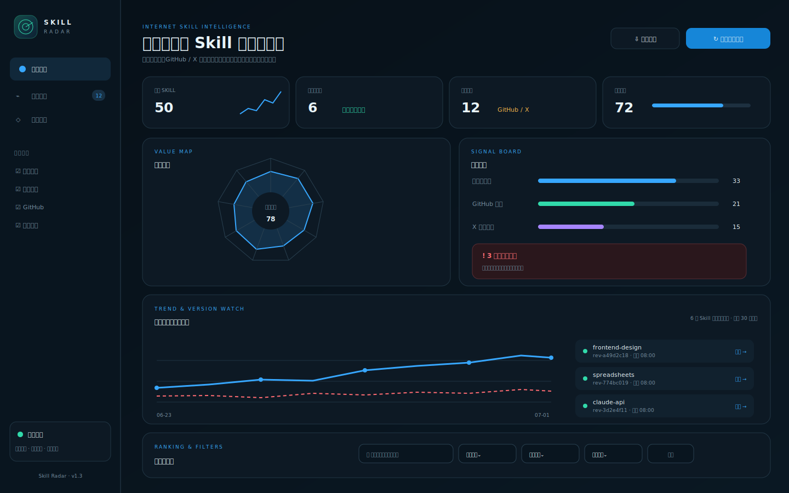

# Skill Radar

互联网 Agent Skill 情报雷达：每天发现、核验、评分并用中文解释值得关注的 Skills。



## 它解决什么问题

Skill Radar 不把“热门”直接等同于“有价值”。它同时观察：

- **实际使用价值**：任务匹配、真实需求、效率杠杆、交付质量和差异化。
- **GitHub 热度**：累计 Stars、两次快照之间的 Star 增长和维护活跃度。
- **X / Twitter 热度**：最近 7 天提及量、独立作者数和公开互动量。
- **风险**：权限、命令执行、联网、凭据、混淆、来源和描述不一致。
- **版本变化**：对每个 `SKILL.md` 计算内容指纹，只在内容真正改变时报告新版本。

X 数据不可用时会显示“未知”，不会按 0 分处理。风险分独立存在，不会被热度抵消。

## 主要功能

- 每日扫描 OpenAI、Anthropic、NVIDIA、Vercel、Hermes 和 GitHub 社区仓库。
- 提供中文用途、适用人群、工作方式、使用时机和风险解释。
- 保存每个 Skill 最近 30 次观测，绘制价值与风险趋势线。
- 检测新收录、内容更新、移除、Stars 变化和评分变化。
- 按关键词、领域、平台、价值区间、建议、来源和风险状态筛选。
- 输入任务关键词，直接搜索 GitHub 中的公开 `SKILL.md`，并把结果加入雷达。
- 确认后安装到 Codex 或 Hermes。
- 导出保留完整目录结构的通用 ZIP，可交给其他支持 `SKILL.md` 的 Agent。
- GitHub Pages 提供只读公开网站；本地模式支持刷新、安装、导出和每日任务。

## 30 秒开始使用

### Windows 本地联网版

```powershell
git clone https://github.com/dezhengz338-source/skill-radar.git
cd skill-radar
.\assets\dashboard\启动联网版.cmd
```

浏览器打开：

```text
http://127.0.0.1:8765
```

首次使用建议：

1. 点击 **立即联网更新** 获取最新数据。
2. 点击 **搜索 GitHub**，输入 PDF、SEO、research 等关键词发现额外 Skill。
3. 用领域、平台和价值区间缩小候选范围。
4. 打开 Skill 详情，检查中文说明、版本变化与风险。
5. 选择 **安装到 Codex**、**安装到 Hermes** 或 **导出通用 Skill 包**。

本地服务只监听 `127.0.0.1`。关闭启动窗口即可停止服务。
GitHub 关键词搜索需要本地联网版；公开 GitHub Pages 仍保持只读。

### 作为 Codex Skill 安装

```powershell
$target = "$HOME\.codex\skills\skill-radar"
git clone https://github.com/dezhengz338-source/skill-radar.git $target
```

重启 Codex 后可以这样调用：

```text
使用 $skill-radar 扫描过去 30 天值得关注的 Skills，
按使用价值、GitHub/X 热度和风险排序，并输出中文采用建议。
```

更新已安装版本：

```powershell
cd "$HOME\.codex\skills\skill-radar"
git pull
```

### Hermes 与其他 Agent

- Hermes：在本地 Dashboard 的详情页选择 **安装到 Hermes**。
- 其他 Agent：选择 **导出通用 Skill 包**，解压后把完整 Skill 文件夹导入目标 Agent。
- 不要只复制 `SKILL.md`；`scripts/`、`references/` 和 `assets/` 可能是 Skill 正常工作的必要部分。

通用包包含：

```text
skill-name/
├── SKILL.md
├── 原始 scripts、references、assets…
├── skill-radar-manifest.json
└── INSTALL.zh-CN.md
```

## 趋势和版本检测

每次刷新会记录：

- 价值、风险、GitHub 热度、X 热度和 Stars。
- `SKILL.md` 内容指纹及简短修订号，例如 `rev-a49d2c18`。
- 新收录、内容已更新、未变化或首次建立版本基线。
- 最近 30 次观测组成的趋势历史。

仓库更新但 Skill 内容没变时不会报告“新版本”。第一次升级到带版本检测的扫描器时只建立基线，避免把全部旧记录误报为更新。

## Dashboard 筛选

排行榜支持组合筛选：

- 搜索名称、用途、说明、作者、仓库、领域或平台。
- 领域：软件开发、研究与知识、文档与办公、销售与增长等。
- 平台：通用 `SKILL.md`、Codex、Claude、Hermes、Cursor、GitHub Copilot。
- 价值区间：80–100、60–79、40–59、0–39。
- 状态：新发现、升温中、有新版本、低风险。

## 每日自动更新

`.github/workflows/daily-refresh.yml` 每天 00:00 UTC（北京时间 08:00）运行，并提交新的 `current.json`。该文件同时保存滚动历史，因此 GitHub Pages 可以直接显示趋势。

如果遇到 GitHub API 限流，在仓库：

```text
Settings → Secrets and variables → Actions → New repository secret
```

添加：

```text
RADAR_GITHUB_TOKEN
```

要启用 X 热度，再添加：

```text
X_BEARER_TOKEN
```

没有 X Token 时，扫描和 GitHub 热度仍会正常工作。

## 发布 GitHub Pages

1. 打开仓库 **Settings → Pages**。
2. 将 Source 设为 **GitHub Actions**。
3. 在 **Actions** 中运行 **Deploy Skill Radar to Pages**。
4. 网站地址为 `https://<用户名>.github.io/skill-radar/`。

在线版为只读模式，不会写入访问者电脑；安装与通用包导出只在本地联网版提供。

## 安全边界

- 隔离候选禁止一键安装和通用包导出。
- 安装与导出前下载到临时目录，完成验证后才移动或打包。
- 拒绝覆盖、路径穿越、符号链接、超大文件和异常文件数量。
- 不自动执行候选 Skill 中的脚本。
- 页面显示兼容性只代表格式或内容信号，不代表已在每个平台完成实机验证。

## 开发与验证

```powershell
node --check assets/dashboard/app.js
python assets/dashboard/server.py --self-test
python assets/dashboard/server.py --refresh-only
```

## 许可证

MIT
